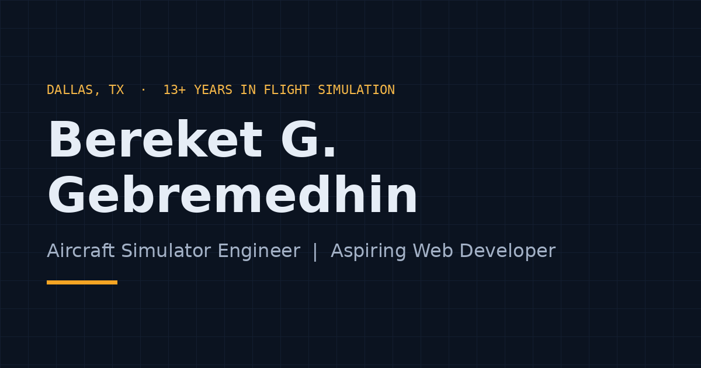

# Bereket G. Gebremedhin — Portfolio

Single-page portfolio for an **Aircraft Simulator Engineer | Aspiring Web Developer**: 13+ years in avionics and full-flight simulator engineering, now expanding into web development.

Built with plain HTML5, CSS3 and Bootstrap 5.3 CSS, plus about 60 lines of vanilla JavaScript (mobile menu and dark/light toggle only). No build tools, no frameworks. Lighthouse: Performance 100, Accessibility 100, Best Practices 100 (SEO 100 once real URLs are filled in).


<!-- [REPLACE] Take a real screenshot (1200x630) and save it as assets/images/screenshot.png, then update the path above. -->

**Live site:** https://[REPLACE-site-name].netlify.app/

---

## Design

"Night Cockpit": a dark instrument-panel palette with one amber accent, one font (Inter), and simple aviation motifs (numbered section labels, a flight-path timeline, a credentials checklist). Dark is the default; visitors can switch to light. Every color pair passes WCAG AA in both themes. Full reference: **[docs/DESIGN-SYSTEM.md](docs/DESIGN-SYSTEM.md)**.

## What's on the page

Navbar → Hero → 01 About → 02 Experience → 03 Skills → 04 Projects → 05 Education & Licenses → 06 Contact → Footer

- Experience (CAE and Ethiopian Airlines) comes right after About: it's the strongest section.
- Skills show engineering as the core skill and web development as a growing one.
- Contact is plain links (email, LinkedIn, GitHub, resume). There's no form, so nothing ever reloads the page.

## Tech stack (everything the page loads)

| What | Source |
|---|---|
| HTML5, CSS3 | `index.html`, `css/style.css` |
| Bootstrap 5.3.3 CSS | `https://cdn.jsdelivr.net/npm/bootstrap@5.3.3/dist/css/bootstrap.min.css` (with integrity hash) |
| Bootstrap Icons 1.11.3 | The 18 icons used, embedded in `index.html` as an SVG sprite (no icon font download) |
| Google Font: Inter 400 + 700 | `https://fonts.googleapis.com/css2?family=Inter:wght@400;700&display=swap` |
| Vanilla JavaScript | `js/main.js`: mobile menu + dark/light toggle only |
| Hosting | Netlify |

Not used: Bootstrap JS, jQuery, animation libraries, icon fonts, any other framework.

## Folder structure

```
portfolio/
├── index.html              # The whole site
├── css/style.css           # All styles; section 1 = colors, font, sizes for both themes
├── js/main.js              # Mobile menu + dark/light toggle
├── assets/
│   ├── images/             # profile.webp, project-N-1200.webp / -600.webp, favicon.svg, og-image.png
│   └── resume/Bereket-Gebremedhin-Resume.pdf   # Placeholder: replace with your resume
├── favicon.ico
├── sitemap.xml
├── robots.txt
├── README.md
├── LICENSE
└── docs/                   # Customization, deployment, resume, case studies, etc.
```

## Run locally

Double-click `index.html`; everything works from the file.
Or run a tiny local server (closer to the real site):

```bash
cd portfolio
python3 -m http.server 8000
# open http://localhost:8000
```

## Customize

Search the project for `[REPLACE` to find every placeholder. Step-by-step instructions: **[docs/CUSTOMIZATION-GUIDE.md](docs/CUSTOMIZATION-GUIDE.md)**.

## Deploy

See **[docs/DEPLOYMENT.md](docs/DEPLOYMENT.md)** (Netlify, GitHub Pages, custom domain).

## Documents in `/docs`

| File | Purpose |
|---|---|
| `CUSTOMIZATION-GUIDE.md` | Exactly where to edit everything |
| `DEPLOYMENT.md` | Publish on Netlify or GitHub Pages, add a custom domain |
| `TESTING-CHECKLIST.md` | What to check before (and after) going live |
| `DESIGN-SYSTEM.md` | Colors, type, spacing, components, review checklist |
| `RESUME.md` | One-page ATS-friendly resume to export to PDF |
| `COVER-LETTER-TEMPLATE.md` | Reusable cover letter |
| `PROJECT-CASE-STUDIES.md` | Write-ups for this portfolio and your course projects |
| `LINKEDIN-PROFILE.md` | Headline, About and Featured text that match the site |

## Credits

- [Bootstrap](https://getbootstrap.com/) and [Bootstrap Icons](https://icons.getbootstrap.com/) — MIT
- [Google Fonts](https://fonts.google.com/): Inter — SIL Open Font License

## License

MIT — see [LICENSE](LICENSE). You may reuse the code; please replace the personal content with your own.
